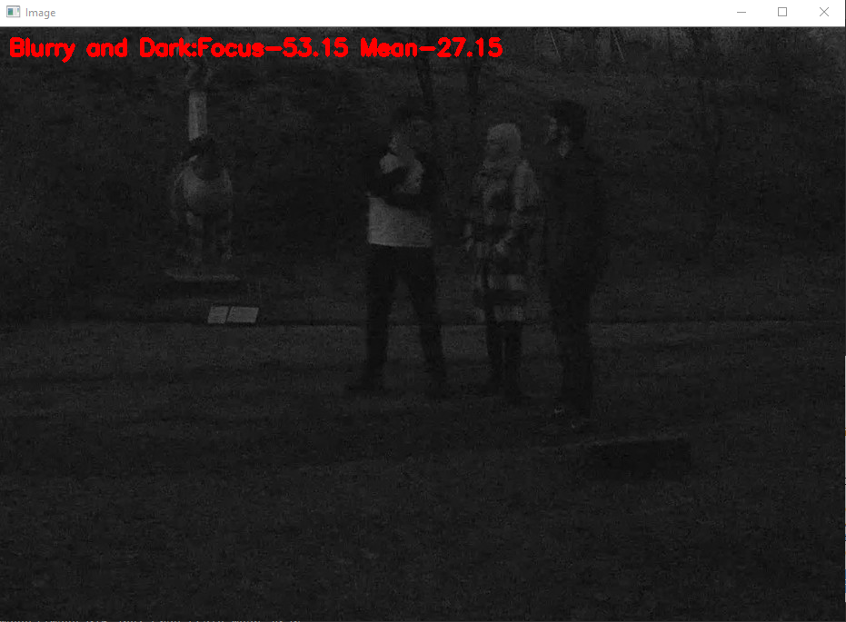
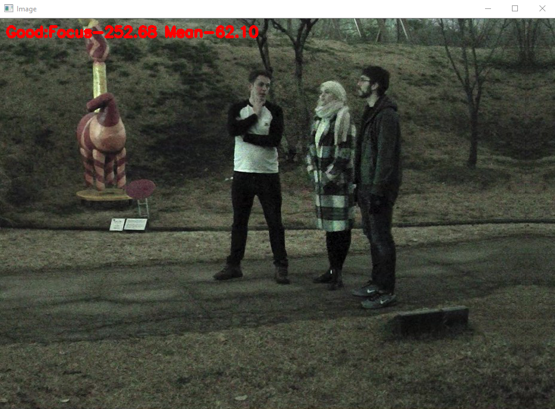
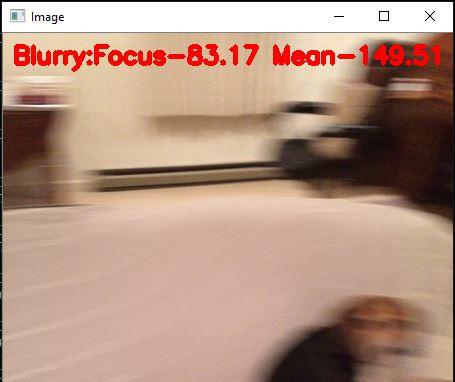
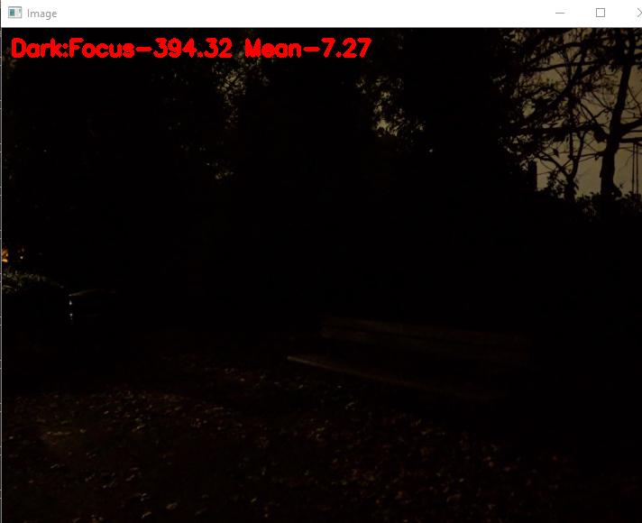
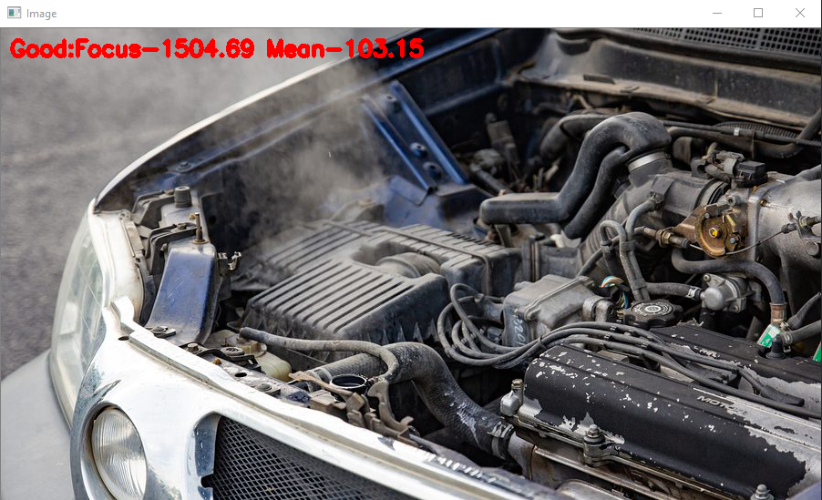
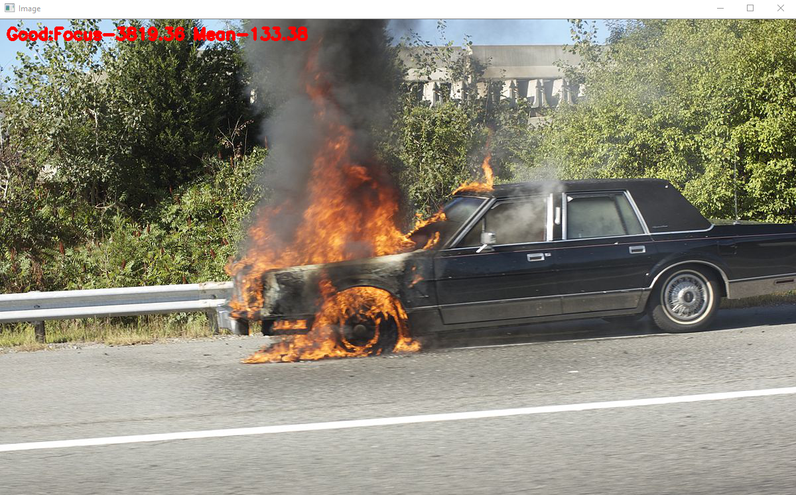

# Detect Blurred/Dark/Good Images
Detecting whether the image is Good to look or Blurred or Darken. 

Below are the output images from detect_blur_dark.py

## Blurred and Darken image

## Good image

## Blurred image

## Darken image

## Good sharpen image

## Sharpe image

